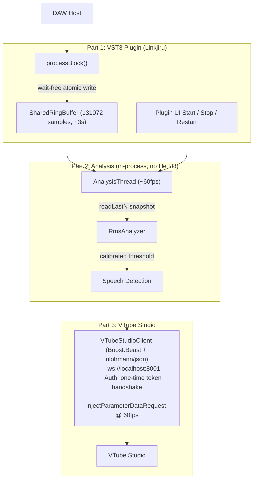

# Architecture

## System Design


## Why we don't use AbstractFifo (please don't try)

We used to use `juce::AbstractFifo` as the bridge between `processBlock()` and everything else. It seemed like the obvious choice. It was not. My bad. I forgor we needed to manage threads outside of the scope of JUCE, and it causes too much pain to architect that kind of system. Why so thready you say? Because `AbstractFifo` is **single-consumer**... the plot thickens

So when we needed an `AnalysisThread` to also read the audio, the only option was to route it through the file that `BufferWriterThread` was already writing: `buffer.raw`. Both threads would just read the same file, right? Enter the infamous race condition.

`replaceWithData()` is not atomic. `loadFileAsData()` is not atomic. There is no lock, no double buffer, no atomic rename. The writer can be halfway through writing 32KB of floats while the reader calls `loadFileAsData()` and gets half old data, half new data. And you won't get an error -- you'll get garbage samples that look almost correct, which is worse. I had to find this out the hard way.

Even if you "fix" the torn reads with file locking or atomic rename. Both threads are in the same process. The data is right there in memory. This however needs to be managed depending on the size of the final inference input vector.

`SharedRingBuffer` fixes all of this. `processBlock()` writes with a single atomic counter bump. Any number of readers can independently snapshot or sequentially read without consuming anything. No file needed for the analysis path.

**Do not reintroduce AbstractFifo.** If you need another reader, just give it a cursor into the SharedRingBuffer. That's the whole point.

# Building the VST & VST3

## Prerequisites

- CMake 3.22+
- C++ compiler (MSVC only please)
- Git submodules for JUCE and VST2.4 SDK: `git submodule update --init --recursive`

Boost and nlohmann/json are fetched automatically by CMake (FetchContent). No manual install needed. First configure will be slower while they download; subsequent runs are cached.

## Configure
### From the repo root
```bash
cd cpp_impl
cmake -B build -DCMAKE_BUILD_TYPE=Release
```

With Ninja (faster builds):

```bash
cmake -B build -G Ninja -DCMAKE_BUILD_TYPE=Release
```

```bash
cmake --build build --config Release --target BuildAll
```

## Artifacts

After building, outputs are copied to `cpp_impl/artifacts/`:

- `artifacts/Linkjiru.vst3/` — VST3 bundle
- `artifacts/Linkjiru.dll` — VST2 plugin

# VTube Studio Integration

The plugin injects a `LinkjiruDetectLowji` custom parameter (0.0 or 1.0) into VTube Studio at ~60fps via WebSocket. Parameter registration is a deliberate user action, not automatic.

## How it works

1. **Start Analysis** — the plugin begins capturing audio and detecting speech. The analysis thread also silently connects to VTS and authenticates in the background (retries every 5s if VTS isn't running yet).
2. **Register in VTS** — once VTS is connected (status label turns yellow), the "Register in VTS" button enables. Click it to create the `LinkjiruDetectLowji` parameter in VTS. The button greys out and shows "Registered" once done.
3. **Parameter injection begins** — after registration, the plugin sends 0.0/1.0 to VTS every frame (~60fps). You can map `LinkjiruDetectLowji` to model behavior in VTS's parameter settings.

## Notes

- **First run auth:** VTS will show an approval popup for the "Linkjiru" plugin. Click allow. The token is encrypted (DPAPI) and saved to `%APPDATA%\Linkjiru\vts_token.dat` so you only do this once.
- **Reconnect:** If VTS is restarted while the plugin is running, it reconnects within ~5 seconds. You'll need to click "Register in VTS" again since VTS forgets custom parameters on restart.
- **No VTS running?** The plugin works fine without it. Analysis still runs, the register button stays greyed out, and nothing breaks.

# Caveats for Development

- The entire audio path (processBlock -> SharedRingBuffer -> AnalysisThread) is lock-free. The one mutex in the codebase is in `VTubeStudioClient` — Boost.Beast's WebSocket stream isn't thread-safe, so the send/disconnect operations need serialization. It only touches network I/O, never the audio pipeline.

# Before You Commit

Run these from `cpp_impl/` before pushing. All three must pass.

### 1. Sanity check (format + lint)

```powershell
cd sanity
.\run_lint.ps1
```

If formatting is off, fix it:

```powershell
.\run_lint.ps1 -Fix
```

### 2. Unit tests

```powershell
cmake --build cmake-build-release --target LinkjiruTests
cmake-build-release\tests\Release\LinkjiruTests.exe
```

### 3. Benchmarks (optional, won't block commit)

```powershell
cmake --build cmake-build-release --target LinkjiruBenchmarks
cmake-build-release\tests\Release\LinkjiruBenchmarks.exe
```

Check `bench_results.csv` for regressions. Benchmarks are timing-sensitive and may vary between machines — use your judgement on failures.

### 4. Build the plugin

```powershell
cmake --build cmake-build-release --target BuildAll --config Release
```

Verify `artifacts/Linkjiru.vst3` and `artifacts/Linkjiru.dll` are updated.
